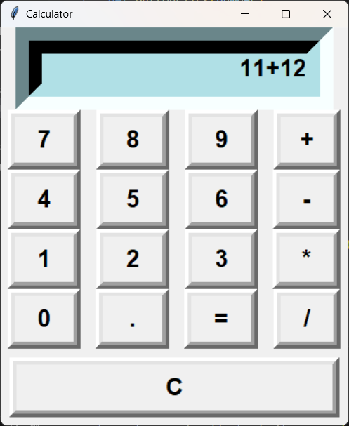

# CodSoft Internship – Python Programming  

## 📌 Overview  
This repository encapsulates my enriching **internship experience at CodSoft**, where I engaged in a series of projects that emphasized the **practical application of Python programming skills**, particularly in **graphical user interface (GUI) development**.  

Over the course of the internship, I successfully completed **five diverse projects**, each tailored to address specific challenges and demonstrate core programming concepts.  

---

## 🛠️ Projects Completed  

### 1. ✅ To-Do List Application  
**Description:** A user-friendly task management tool that simplifies the organization of daily activities.  
**Tech Used:** Python, Tkinter  
**Key Features:** Add, update, and delete tasks with an interactive interface.  
**Skills Learned:** GUI design, event-driven programming, task management.  

---

### 2. 🧮 Calculator Application  
**Description:** A fully functional calculator capable of performing basic arithmetic operations.  
**Tech Used:** Python, Tkinter  
**Key Features:** Addition, subtraction, multiplication, division with real-time event handling.  
**Skills Learned:** GUI layout management, logic implementation, error handling. 

---

### 3. 🔑 Password Generator  
**Description:** A secure password generator to create strong, random passwords.  
**Tech Used:** Python, Tkinter, `random` & `string` modules  
**Key Features:** Customizable password length, randomization for enhanced security.  
**Skills Learned:** String manipulation, randomization, secure coding practices.  

---

### 4. 🎮 Rock, Paper, Scissors Game  
**Description:** An interactive game between user and computer.  
**Tech Used:** Python, Tkinter, `random` module  
**Key Features:** Dynamic score tracking, interactive gameplay.  
**Skills Learned:** Algorithmic design, randomization, GUI integration.  

---

### 5. 📑 Contact Management System  
**Description:** A comprehensive application for managing contacts.  
**Tech Used:** Python, Tkinter, File Handling  
**Key Features:** Add, view, update, and delete contact information with popup details.  
**Skills Learned:** CRUD operations, advanced GUI design, event-driven programming, data management.  

